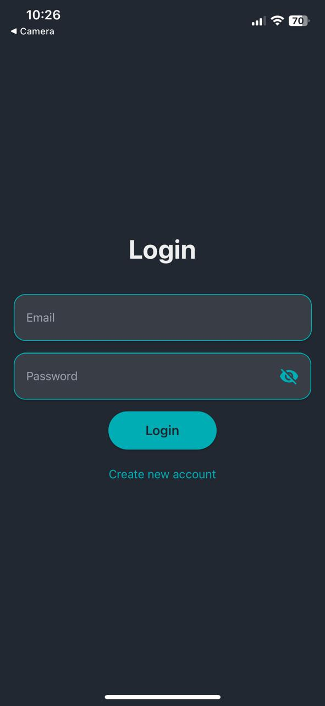
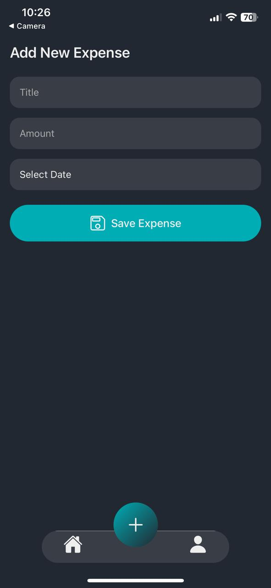
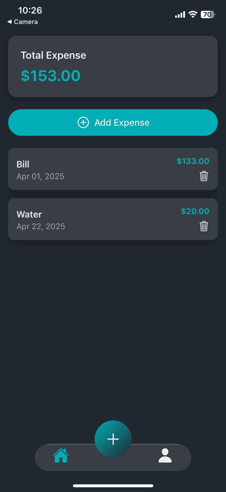
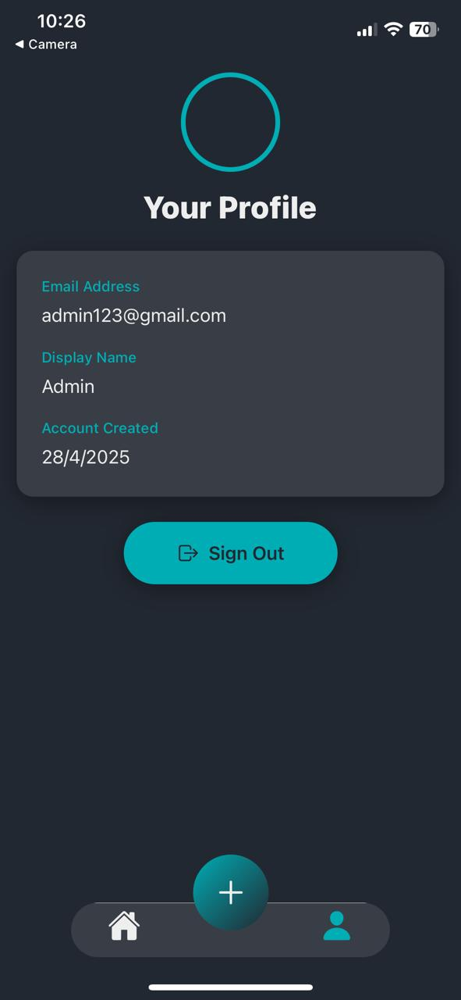
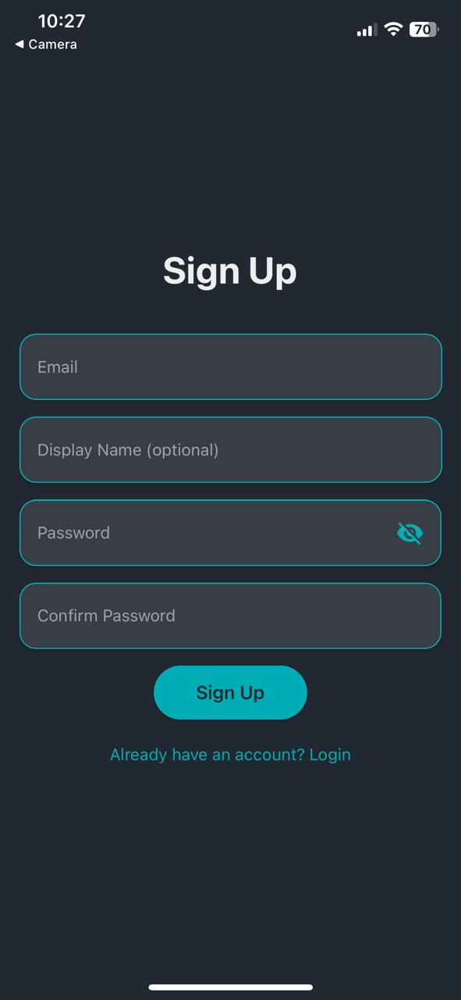

# Mobile Expense Tracker App

A simple mobile expense tracking application built with React Native and Expo.  
Easily add, view, and manage your expenses with Firebase authentication and a smooth multi-screen experience.

---

## ✨ Features Implemented

- ➕ Add a new expense with form validations
- 📋 List all expenses
- 🗑️ Delete expenses
- 💰 View total expense

---

## 🎁 Bonus Features

- 🔐 Login screen with Firebase authentication
- 🔒 Persist login session using Async Storage
- 🧭 Multi-screen navigation with **tabs** (using `expo-router`)
- ⏳ Loading and error states for better UX

---

## 🛠️ Tech Stack Used

**Frontend:**

- Expo React Native
- Expo Router (Stack and Tab navigation)
- TailwindCSS styling using `nativewind`

**Backend / Storage:**

- Firebase (Authentication)
- Async Storage (Persist login sessions)
- MockAPI (Database for storing expenses)

---

## 🚀 Setup Instructions

1. **Clone the repository:**

```bash
git clone https://github.com/your-username/mobile-expense-tracker-app.git
```

2. **Navigate to the project directory:**

```bash
cd mobile-expense-tracker-app
```

3. **Install dependencies:**

```bash
npm install
```

4. **Configure Firebase:**

- Create a Firebase project.
- Go to your Firebase console and create a web app to get your config.
- Replace the placeholders in `app/firebase/config.ts` with your Firebase configuration:

```ts
export const firebaseConfig = {
  apiKey: "YOUR_API_KEY",
  authDomain: "YOUR_AUTH_DOMAIN",
  projectId: "YOUR_PROJECT_ID",
  storageBucket: "YOUR_STORAGE_BUCKET",
  messagingSenderId: "YOUR_MESSAGING_SENDER_ID",
  appId: "YOUR_APP_ID",
};
```

> ⚠️ **Important**: Ensure Firebase Authentication is enabled (Email/Password sign-in).

5. **Start the Expo development server:**

```bash
npx expo start
```

6. **Run the App:**

- Install **Expo Go** on your mobile device.
- Scan the QR code displayed in your terminal or browser.
- App should now run on your device!

---

## 🧩 Requirements for Running the App

- Node.js >= 18
- Expo CLI installed (`npm install -g expo-cli`)
- Expo Go app installed on your Android/iOS device
- Internet connection (to fetch data from Firebase / MockAPI)

---

## 📸 (Optional) Screenshots

> You can add screenshots here to showcase login, add expense, list, delete features. Example:
>
> |                          Login                          |                      Expense List                       |                        Add Expense                        |
> | :-----------------------------------------------------: | :-----------------------------------------------------: | :-------------------------------------------------------: |
> |      |  |  |
> |                         Profile                         |                         Sign Up                         |
> | :-----------------------------------------------------: |     :--------------------------------------------:      |
> |  |           |

---

## 📜 License

This project is open-sourced for educational purposes.
